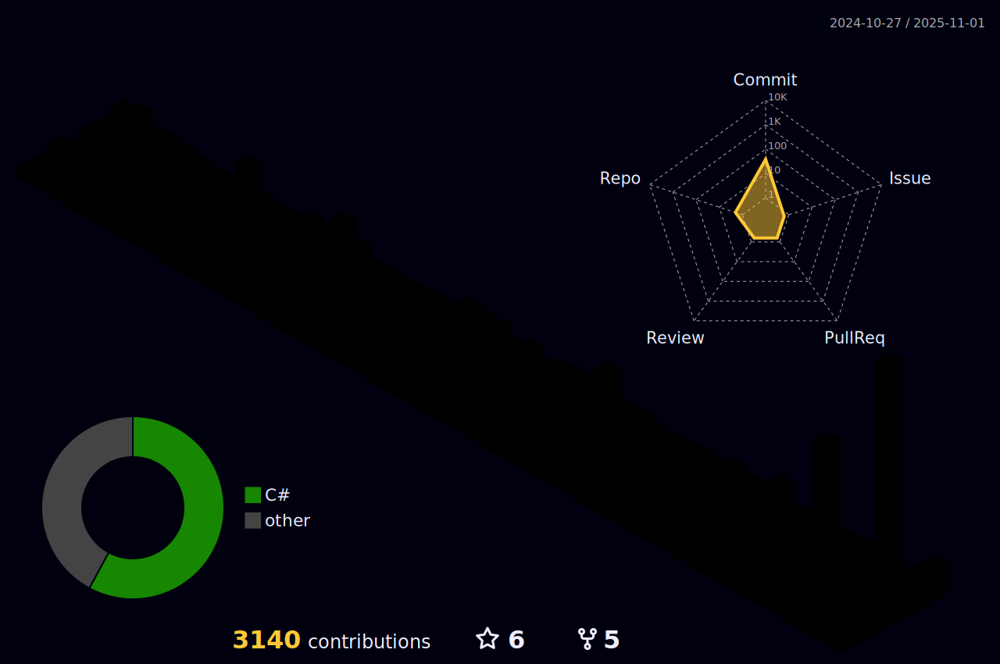

<!-- MAGICAL ANIMATED HEADER WITH GLOWING EFFECT -->

  

<!-- MYSTICAL TYPING SVG HEADER -->

<!-- ANIMATED WIZARD CASTING SPELLS -->

<!-- MAGICAL STATS CARD -->

<!-- COMMIT ACTIVITY ENCHANTMENT CHART -->

<!-- STATS CARDS WITH MAGICAL GLOW EFFECT -->

  <!-- GITHUB STREAK WITH MYSTICAL THEME -->
  

  <!-- LANGUAGE STATS WITH MAGICAL GLOW -->
  

<!-- ARCANE SKILLS SECTION WITH GLOWING EFFECT -->

  

<!-- MAGICAL SKILL BADGES -->

<!-- TROPHIES DISPLAY -->

  

<!-- MAGICAL WISDOM SCROLLS SECTION -->

  

<!-- 3D CONTRIBUTION CALENDAR WITH GITHUB ACTION SETUP -->

  

  <!-- MAGICAL HARRY POTTER STYLE WIZARD IMAGE -->
  

  <picture>
    <source media="(prefers-color-scheme: dark)" srcset="profile-3d-contrib/profile-night-rainbow.svg">
    <source media="(prefers-color-scheme: light)" srcset="profile-3d-contrib/profile-green-animate.svg">
    
  </picture>

<!-- GITHUB METRICS SECTION WITH IMPROVED LAYOUT -->

  

<!-- GITHUB METRICS BADGES -->

  
  
  
  
  
  

<!-- GITHUB PROFILE DETAILS WITH PROPER CENTERING -->

  

<!-- MAGICAL COMMUNICATION PORTALS -->

  

<!-- GLOWING CONTACT BUTTONS -->

  
  
  

<!-- VISITOR COUNTER WITH MAGICAL ANIMATION -->

  

  <!-- MAGICAL EMOJI HEADER WITH SPARKLE EFFECT -->
  <h2 align="center">
    
  </h2>

  

    
  

<!-- MAGICAL SPARKLES ANIMATION -->

  

<!-- FOOTER WITH CREDITS -->

  ⚡ README crafted with arcane digital sorcery by The CrankyMagician ⚡
   
  🔮 Last enchanted on the night of the full moon 🔮

